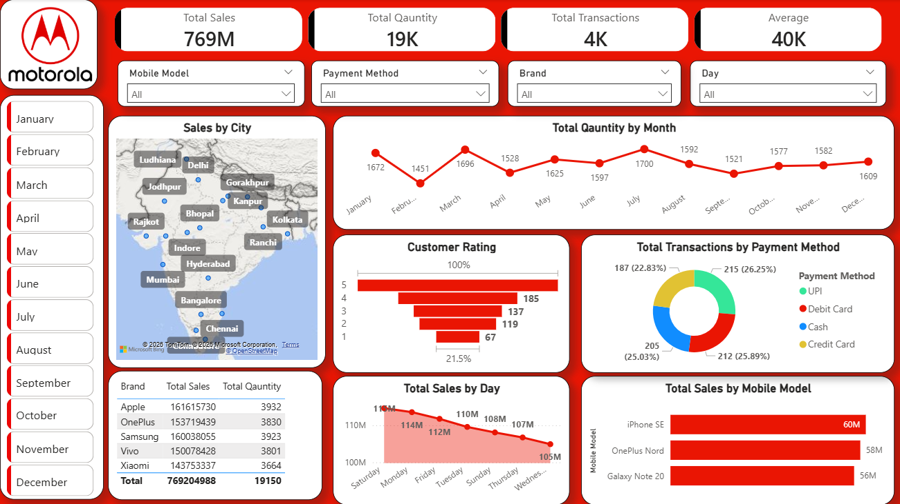

# Mobile Sales Analysis Dashboard | Power BI

## Overview

This project is an interactive Mobile Sales Analysis Dashboard developed using Power BI to analyze sales performance across different cities, brands, mobile models, payment methods, customer ratings, and time periods.

The dashboard transforms raw sales data into actionable insights, enabling businesses to monitor performance, understand customer behavior, and make data-driven decisions.

---

## Business Objectives

* Monitor overall sales performance using key business metrics.
* Analyze sales distribution across cities and regions.
* Identify top-performing brands and mobile models.
* Evaluate customer satisfaction through rating analysis.
* Understand transaction trends and payment preferences.
* Discover monthly and daily sales patterns.

---

## Tools & Technologies

* Power BI
* Power Query
* DAX
* Microsoft Excel
* Data Modeling
* Data Visualization

---

## Dataset Information

The dataset includes:

* Mobile Brand
* Mobile Model
* Sales Amount
* Quantity Sold
* Transaction Details
* Customer Ratings
* Payment Methods
* City Information
* Purchase Date

---

## Dashboard Features

### KPI Summary

| Metric             | Value |
| ------------------ | ----- |
| Total Sales        | 769M  |
| Total Quantity     | 19K   |
| Total Transactions | 4K    |
| Average Sales      | 40K   |

### Interactive Filters

* Mobile Model
* Brand
* Payment Method
* Day
* Month

### Sales by City

Analyze geographic sales distribution across major Indian cities and identify high-performing markets.

### Monthly Quantity Trend

Track quantity sold across months to identify seasonal demand patterns and inventory requirements.

### Customer Rating Analysis

Evaluate customer satisfaction using ratings ranging from 1 to 5 stars.

### Payment Method Analysis

Compare transactions across:

* UPI
* Debit Card
* Cash
* Credit Card

### Brand Performance Analysis

Compare sales and quantity performance for major smartphone brands:

* Apple
* Samsung
* OnePlus
* Vivo
* Xiaomi

### Mobile Model Performance

Identify top-selling mobile models and revenue-generating products.

### Daily Sales Analysis

Analyze sales patterns across different days of the week to support operational planning.

---

## Key Insights

* Apple generated the highest overall sales revenue.
* iPhone SE emerged as the best-performing mobile model.
* Major metropolitan cities contributed significantly to total sales.
* Digital payment methods accounted for the majority of transactions.
* Customer ratings indicate strong overall product satisfaction.
* Monthly sales remained relatively consistent throughout the year.

---

## Business Recommendations

* Increase inventory levels for high-performing mobile models.
* Focus marketing campaigns on top-performing cities.
* Expand premium smartphone offerings.
* Promote digital payment adoption through customer incentives.
* Investigate lower-rated products to improve customer experience.
* Use historical sales trends to support demand forecasting.

---

## Repository Structure

```text
Mobile-Sales-Dashboard/
│
├── Mobile Sales Data.xlsx
├── Project.pbix
├── Dashboard Screenshot.png
└── README.md
```

---

## Skills Demonstrated

* Data Cleaning
* Data Transformation
* Data Modeling
* DAX Calculations
* KPI Development
* Business Intelligence
* Data Visualization
* Sales Analytics
* Customer Analytics
* Dashboard Design

---

## Dashboard Preview



---

## Author

Ishwar Sahani

LinkedIn: https://linkedin.com/in/ishwarsahani18
GitHub: https://github.com/Mystic-Ishwar

